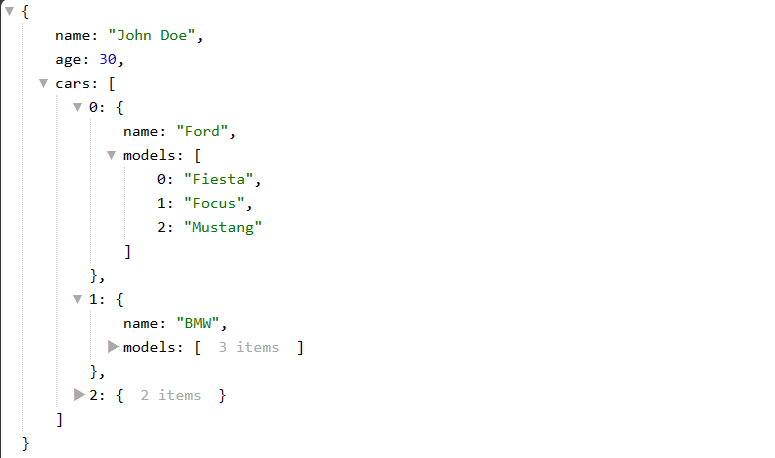

# react-json-viewer

> A simple react component to display a JSON in a tree view with syntax highlighting. 

[](https://www.npmjs.com/package/@htmujahid/react-json-viewer) [](https://standardjs.com)



## Install

```bash
npm install --save @htmujahid/react-json-viewer
```

## Usage

```jsx
import ReactJsonViewer from "@htmujahid/react-json-viewer";

export default function Home() {
    return (
        <div>
            <ReactJsonViewer
                data={{
                    name: "John Doe",
                    age: 30,
                    cars: [
                        {
                            name: "Ford",
                            models: ["Fiesta", "Focus", "Mustang"],
                        },
                        { name: "BMW", models: ["320", "X3", "X5"] },
                        { name: "Fiat", models: ["500", "Panda"] },
                    ],
                }}
            />
        </div>
    );
}
```

## Component Properties

| Prop       | Type     | Required | Default Value | Description                                                                                  | Example Value         |
|------------|----------|----------|---------------|----------------------------------------------------------------------------------------------|-----------------------|
| data       | any      | Yes      |               | The JSON data to be displayed in the JSON viewer.                                            | `{ "name": "John" }`  |
| root       | string   | No       | ""            | The root key name of JSON data                                                               | `"example"`           |
| filter     | string   | No       | ""            | A filter string to start displaying the JSON data.                                           | `"some_key"`          |
| maxLevel   | number   | No       | -1            | The maximum depth to which the JSON should be expanded. Use -1 to expand all levels.         | `3`                   |
| columnAt   | number   | No       | -1            | The column number at which to start displaying JSON data. Use -1 for no specific column.     | `2`                   |

## Customization

You can customize the JSON viewer by overriding the following CSS classes:

| Class Name                     | Description                                                                 |
|--------------------------------|-----------------------------------------------------------------------------|
| `.json-viewer`                 | The root class of the JSON viewer.                                          |
| `.json-viewer .type-string`    | The class for string type values.                                           |
| `.json-viewer .type-number`    | The class for number type values.                                           |
| `.json-viewer .type-boolean`   | The class for boolean type values.                                          |
| `.json-viewer .type-null`      | The class for null type values.                                             |
| `.json-viewer .type-undefined` | The class for undefined type values.                                        |
| `.json-viewer .type-date`      | The class for date type values.                                             |
| `.json-viewer .list-link`      | The class for the href link of list items.                                  |


